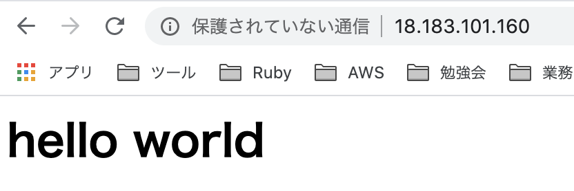

# ec2でwebサーバを作る
## 概要
```
1. EC2インスタンスを作成
2. ssh接続
3. apachをインストール
4. index.htmlファイルを作成
5. 確認
```

## 1. EC2インスタンスを作成
- 今回はAmazonLinuxを選択(OSの選択は好みらしい)
- インスタンスタイプはt2.micro(無料枠)
- インスタンスの詳細設定は変更なし
  * VPCは今回はデフォルトのものを使用
- ストレージは汎用SSD(無料枠)
- タグはname=web1aとする
- セキュリティグループは下記で設定(ipは全許可)
  * ssh
  * http
  * https
- キーペア基本は既存ので
- キーペアを新規で作成する場合は、ダウンロードして~/.sshあたりに入れておく(なくしたらEC2に入れなくなる！！)

## 2. ssh接続
- 権限を設定
  - chmod 600 ~/.ssh/kobori_secret.pem
- ssh ec2-user@パブリックip -i ~/.ssh/kobori_secret.pem
  * Amazon Linux: ec2-user
  * RHEL: ec2-user or root
  * Ubuntu: ubuntu or root
  * Centos: centos

## 3. apachをインストール
- root権限に移動
  - sudo -s
- アップデート確認
  - yum udpate -y
- apachをインストール
  - yum install  httpd -y

## 4. index.htmlファイルを作成
- フォルダ移動(apachインストール時に作成されたディレクトリ)
  - cd /var/www/html
- index.htmlファイルを作成して中身を適当に記述(index.htmlが自動でルートパスに設定される)
  - vim index.html

## 5. 確認
- apach起動
  - service httpd start
- パブリックipにアクセスするとindex.htmlの内容が確認できる

